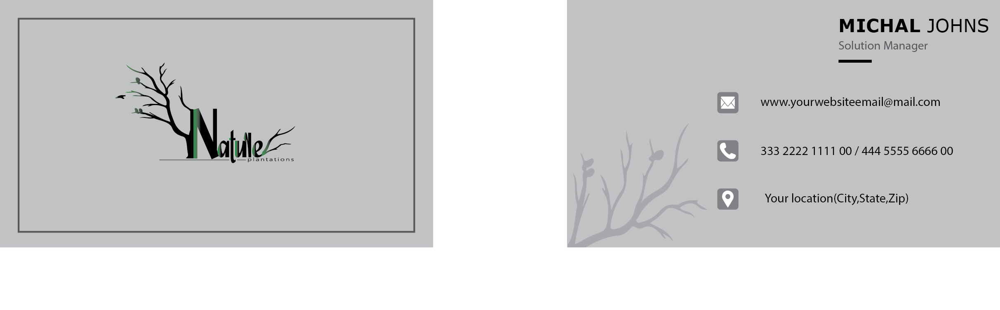
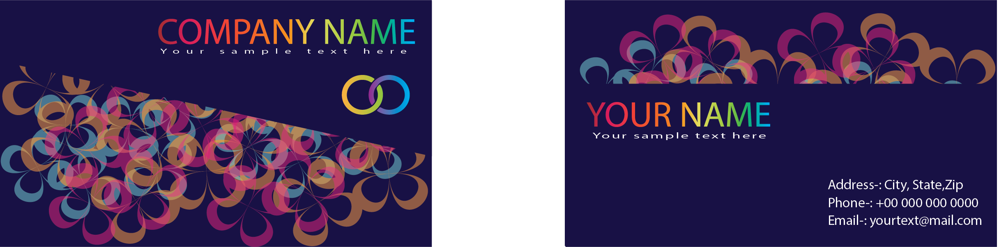
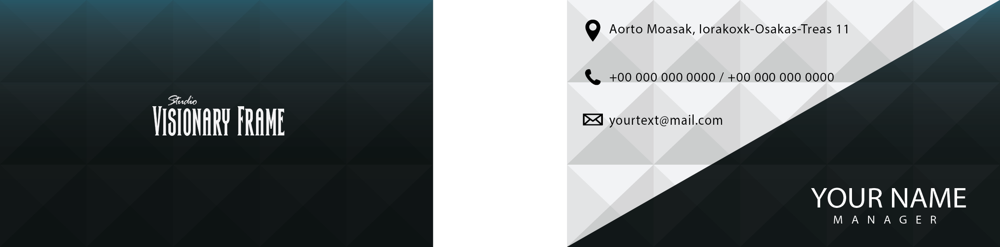
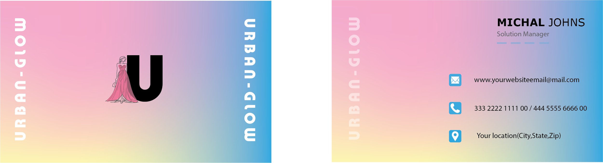
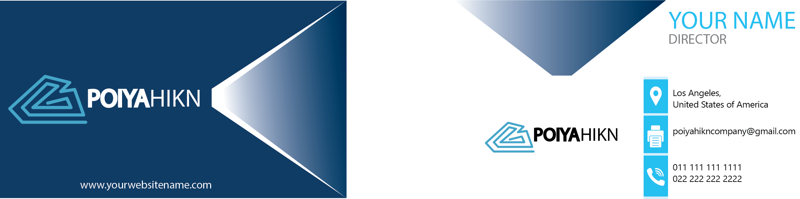
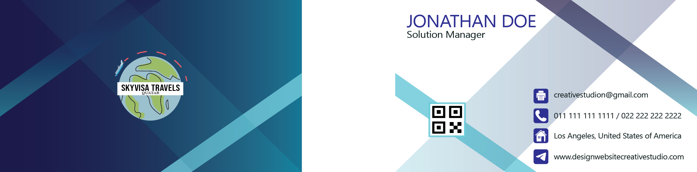

# 🎨 My Illustration Portfolio

Welcome to my creative space! This repository showcases a collection of graphic designs, branding materials, and vector illustrations created using **Adobe Illustrator**.

## 📌 Featured Categories
* **Logos & Branding:** Custom brand identities and professional logos.
* **Business Cards:** Modern and premium business card layouts.
* **UI Elements:** Icons and interface components for web/mobile apps.
* **Posters & Social Media:** Creative visual content for digital marketing.

## 🛠️ Tools & Technologies
* **Adobe Illustrator:** Primary tool for vector art and layouts.
* **Adobe Photoshop:** For mockups and photo editing.
* **Canva:** For quick social media graphics.

---

## 📇 Featured Design: Professional Business Card
Here is a preview of a premium business card design I recently completed.

> **Note:** Each folder contains the high-quality **PNG** image and the original **AI (Source File)** for reference.

---

## 💼 Open for Commissions!
Are you looking for a custom design for your brand or business? I am now accepting freelance projects for:
* Logo Design
* Business Cards
* Social Media Posters
* Vector Illustrations

📩 **Direct Message me on my GitHub & Check out my creative designs and coding projects [LinkedIn](https://www.linkedin.com/in/kasuni-prabodha) for inquiries!**

---
© 2026 Kasuni Prabodha. All rights reserved.
